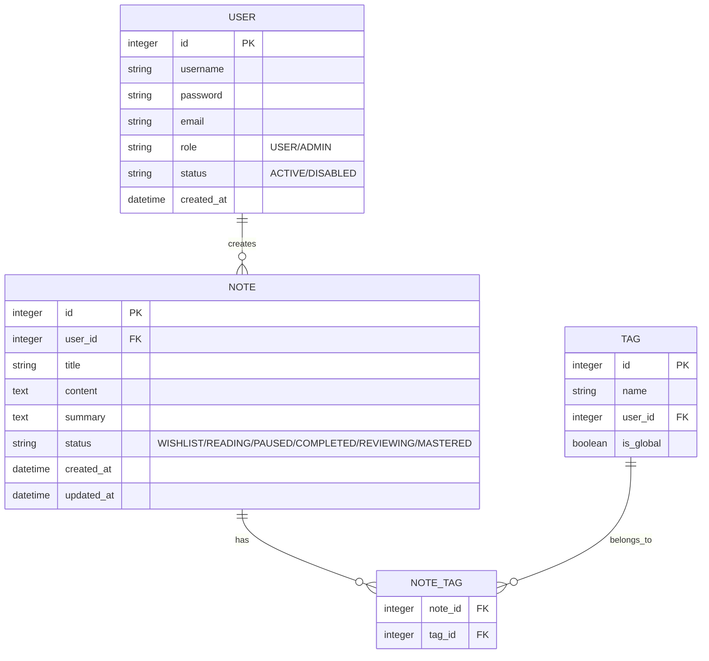

```mermaid
erDiagram
    USER ||--o{ NOTE : creates
    USER {
        integer id PK
        string username
        string password
        string email
        string role "USER/ADMIN"
        string status "ACTIVE/DISABLED"
        datetime created_at
    }
    NOTE ||--o{ NOTE_TAG : has
    NOTE {
        integer id PK
        integer user_id FK
        string title
        text content
        text summary
        string status "WISHLIST/READING/PAUSED/COMPLETED/REVIEWING/MASTERED"
        datetime created_at
        datetime updated_at
    }
    TAG ||--o{ NOTE_TAG : belongs_to
    TAG {
        integer id PK
        string name
        integer user_id FK
        boolean is_global
    }
    NOTE_TAG {
        integer note_id FK
        integer tag_id FK
    }
```
