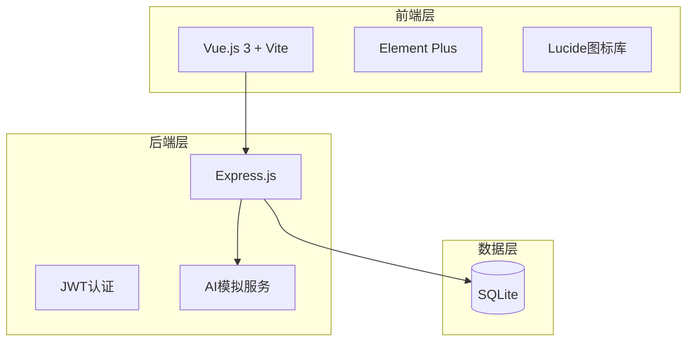

1. 架构设计

```mermaid
graph TB
    subgraph 前端层
        V[Vue.js 3 + Vite]
        EP[Element Plus]
        L[Lucide图标库]
    end

    subgraph 后端层
        E[Express.js]
        JWT[JWT认证]
        AI[AI模拟服务]
    end

    subgraph 数据层
        S[(SQLite)]
    end

    V --> E
    E --> S
    E --> AI
```
